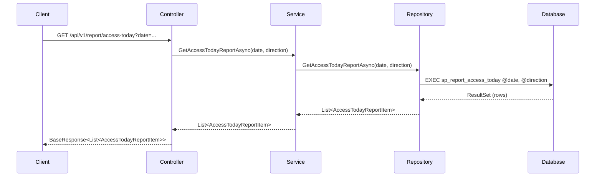

# 08. Hướng dẫn Tạo Báo cáo (Report)

**Ngày**: 2025-10-28  
**Phiên bản**: 2.0  
**Mục đích**: Hướng dẫn đầy đủ về cách tạo chức năng báo cáo dựa trên implementation thực tế của ReportController

> 📌 **QUAN TRỌNG**: Tài liệu này mô tả cách triển khai thực tế đang hoạt động trong codebase

---

## 1. Tổng quan Quy trình

Hệ thống báo cáo được thiết kế theo kiến trúc 4 lớp:
1. **Database Layer** - Stored Procedures (Tầng Cơ sở dữ liệu)
2. **DAL Layer** - Repository pattern (Tầng Truy cập dữ liệu)
3. **BLL Layer** - Service layer (Tầng Logic nghiệp vụ)
4. **API Layer** - Controller endpoints (Tầng API)

**Các loại báo cáo đã triển khai:**
- ✅ Báo cáo lượt vào/ra hôm nay
- ✅ Báo cáo phương tiện đang gửi
- ✅ Báo cáo cuộc họp đang diễn ra  
- ✅ Báo cáo nhân sự theo bộ phận
- ✅ Báo cáo phương tiện đã đăng ký
- ✅ Báo cáo tình trạng thiết bị
- ✅ Báo cáo chấm công
- ✅ Báo cáo tổng hợp (nhiều dataset)

---

## 2. Tầng Database - Stored Procedures

### 2.1. Quy ước đặt tên

```
sp_report_{category}_{report_name}
```

**Ví dụ:**
- `sp_report_access_today` - Báo cáo lượt vào/ra hôm nay
- `sp_report_parked_vehicles` - Báo cáo phương tiện đang gửi
- `sp_report_personnel_by_department` - Báo cáo nhân sự theo phòng ban
- `sp_report_comprehensive` - Báo cáo tổng hợp (nhiều dataset)

### 2.2. Ví dụ Báo cáo đơn dataset (Single Dataset)

```sql
-- File: customer_docs/StoredProcedures_Report.sql

-- Báo cáo lượt vào/ra hôm nay
CREATE PROCEDURE sp_report_access_today
    @date DATETIME = NULL,
    @direction NVARCHAR(10) = NULL  -- 'IN' hoặc 'OUT'
AS
BEGIN
    SET NOCOUNT ON;
    
    -- Nếu không truyền ngày, lấy ngày hiện tại
    IF @date IS NULL
        SET @date = CAST(GETDATE() AS DATE);
    
    SELECT 
        e.oid AS Id,
        e.event_timestamp AS Time,
        p.full_name AS Name,
        p.card_id AS CardId,
        loc.name AS Location,
        CASE 
            WHEN e.direction = 'in' THEN N'Vào'
            ELSE N'Ra'
        END AS Direction,
        e.access_method AS Method,
        p.person_type AS PersonType,
        e.image_url AS ImageUrl
    FROM event_access e
    INNER JOIN core_person p ON e.person_oid = p.oid
    LEFT JOIN core_location loc ON e.location_oid = loc.oid
    WHERE CAST(e.event_timestamp AS DATE) = CAST(@date AS DATE)
      AND (@direction IS NULL OR e.direction = @direction)
    ORDER BY e.event_timestamp DESC;
END
```

**Giải thích:**
- Procedure nhận 2 tham số: `@date` (ngày) và `@direction` (hướng Vào/Ra)
- Default `@date = NULL` sẽ lấy ngày hiện tại
- Join 3 bảng: `event_access`, `core_person`, `core_location`
- Return về 1 ResultSet với thông tin lượt ra vào

### 2.3. Ví dụ Báo cáo nhiều dataset (Multiple Dataset)

```sql
-- Báo cáo tổng hợp (Trả về nhiều ResultSet)
CREATE PROCEDURE sp_report_comprehensive
    @from_dt DATETIME = NULL,
    @to_dt DATETIME = NULL
AS
BEGIN
    SET NOCOUNT ON;
    
    -- Set default nếu không truyền
    IF @from_dt IS NULL
        SET @from_dt = CAST(GETDATE() AS DATE);
    
    IF @to_dt IS NULL
        SET @to_dt = CAST(GETDATE() AS DATE);
    
    -- ResultSet 1: Dữ liệu tổng hợp (Summary)
    SELECT 
        GETDATE() AS ReportDate,
        @from_dt AS FromDate,
        @to_dt AS ToDate,
        -- Nhân sự
        (SELECT COUNT(*) FROM core_person) AS TotalPersonnel,
        (SELECT COUNT(*) FROM core_person WHERE app_st = 1) AS ActivePersonnel,
        -- Phương tiện
        (SELECT COUNT(*) FROM core_vehicle) AS TotalVehicles,
        (SELECT COUNT(*) FROM core_vehicle WHERE app_st = 1) AS ActiveVehicles,
        -- Lượt ra vào
        (SELECT COUNT(*) FROM event_access WHERE direction = 'in' 
         AND CAST(event_timestamp AS DATE) = CAST(@from_dt AS DATE)) AS TodayAccessIn,
        (SELECT COUNT(*) FROM event_access WHERE direction = 'out' 
         AND CAST(event_timestamp AS DATE) = CAST(@from_dt AS DATE)) AS TodayAccessOut
    ;
    
    -- ResultSet 2: Chi tiết lượt ra vào (Access Details)
    SELECT 
        e.oid AS Id,
        e.event_timestamp AS Time,
        p.full_name AS Name,
        p.card_id AS CardId,
        loc.name AS Location,
        e.direction AS Direction
    FROM event_access e
    INNER JOIN core_person p ON e.person_oid = p.oid
    LEFT JOIN core_location loc ON e.location_oid = loc.oid
    WHERE e.event_timestamp BETWEEN @from_dt AND @to_dt
    ORDER BY e.event_timestamp DESC;
    
    -- ResultSet 3: Chi tiết nhân sự theo phòng ban (Personnel Details)
    SELECT 
        dept.name AS Department,
        COUNT(*) AS Total,
        SUM(CASE WHEN p.app_st = 1 THEN 1 ELSE 0 END) AS Active,
        SUM(CASE WHEN p.app_st = 0 THEN 1 ELSE 0 END) AS Locked
    FROM core_person p
    LEFT JOIN core_orgunit dept ON p.orgunit_oid = dept.oid
    GROUP BY dept.name
    ORDER BY dept.name;
    
    -- Có thể thêm nhiều ResultSet khác...
END
```

**Giải thích:**
- Procedure trả về nhiều ResultSet (dataset)
- ResultSet 1: Dữ liệu tổng hợp, thống kê
- ResultSet 2: Chi tiết lượt ra vào
- ResultSet 3: Chi tiết nhân sự theo phòng ban
- Frontend sẽ nhận được object phức tạp với nhiều danh sách con

---

## 3. Tầng Model

### 3.1. Model cho Báo cáo đơn giản

```csharp
// File: UNI.Resident.Model/Report/ReportModels.cs

/// <summary>
/// Model cho 1 dòng dữ liệu báo cáo lượt vào/ra
/// </summary>
public class AccessTodayReportItem
{
    public string Id { get; set; }              // ID sự kiện
    public DateTime Time { get; set; }          // Thời gian
    public string Name { get; set; }           // Họ tên
    public string CardId { get; set; }        // Mã thẻ
    public string Location { get; set; }       // Vị trí
    public string Direction { get; set; }      // Vào/Ra
    public string Method { get; set; }         // Phương thức: Face, Card, Manual
    public string PersonType { get; set; }     // Loại: Staff, Student, Guest
    public string ImageUrl { get; set; }       // Link ảnh
}
```

### 3.2. Model cho Báo cáo phức tạp (Multi-dataset)

```csharp
/// <summary>
/// Model cho báo cáo tổng hợp (chứa nhiều danh sách con)
/// </summary>
public class ComprehensiveReportData
{
    // Thông tin thời gian báo cáo
    public DateTime ReportDate { get; set; }
    public DateTime FromDate { get; set; }
    public DateTime ToDate { get; set; }
    
    // Tổng hợp nhân sự
    public int TotalPersonnel { get; set; }
    public int ActivePersonnel { get; set; }
    
    // Tổng hợp phương tiện
    public int TotalVehicles { get; set; }
    public int ActiveVehicles { get; set; }
    
    // Các danh sách chi tiết (từ các ResultSet khác nhau)
    public List<AccessTodayReportItem> AccessDetails { get; set; }
    public List<PersonnelReportItem> PersonnelDetails { get; set; }
    public List<VehicleReportItem> VehicleDetails { get; set; }
}
```

**Giải thích:**
- Model đơn giản: 1 class chứa các thuộc tính của 1 dòng
- Model phức tạp: 1 class chứa thông tin tổng hợp + nhiều danh sách con
- Properties trùng với column names trong SP để Dapper map tự động

---

## 4. Tầng DAL - Repository

```csharp
// File: UNI.Resident.DAL/Repositories/Report/ReportRepository.cs

public class ReportRepository : UniBaseRepository, IReportRepository
{
    /// <summary>
    /// Báo cáo lượt vào/ra - Đơn dataset
    /// </summary>
    public async Task<List<AccessTodayReportItem>> GetAccessTodayReportAsync(
        DateTime? date = null, 
        string direction = null)
    {
        const string storedProcedure = "sp_report_access_today";
        
        // Dùng GetListAsync cho báo cáo đơn giản
        // Tự động map SP result vào List<AccessTodayReportItem>
        return await base.GetListAsync<AccessTodayReportItem>(storedProcedure, 
            new { date = date ?? DateTime.Today, direction });
    }
    
    /// <summary>
    /// Báo cáo tổng hợp - Nhiều dataset
    /// </summary>
    public async Task<ComprehensiveReportData> GetComprehensiveReportAsync(
        DateTime? fromDate = null, 
        DateTime? toDate = null)
    {
        const string storedProcedure = "sp_report_comprehensive";
        
        // Dùng GetMultipleAsync cho báo cáo có nhiều ResultSet
        // Phải đọc từng ResultSet và combine lại
        var result = await base.GetMultipleAsync(storedProcedure, 
            new { from_dt = fromDate, to_dt = toDate }, 
            async reader =>
        {
            // Đọc ResultSet 1: Thông tin tổng hợp
            var summary = reader.ReadFirstOrDefault<ComprehensiveReportData>();
            
            // Đọc ResultSet 2: Chi tiết lượt ra vào
            var accessDetails = reader.Read<AccessTodayReportItem>().ToList();
            
            // Đọc ResultSet 3: Chi tiết nhân sự
            var personnelDetails = reader.Read<PersonnelReportItem>().ToList();
            
            // Đọc ResultSet 4: Chi tiết phương tiện
            var vehicleDetails = reader.Read<VehicleReportItem>().ToList();
            
            // Gắn các danh sách vào object chính
            if (summary != null)
            {
                summary.AccessDetails = accessDetails;
                summary.PersonnelDetails = personnelDetails;
                summary.VehicleDetails = vehicleDetails;
            }
            
            return summary;
        });
        
        return result;
    }
}
```

**Giải thích:**
- `GetListAsync<T>`: Dùng cho SP trả về 1 ResultSet
- `GetMultipleAsync`: Dùng cho SP trả về nhiều ResultSet
- Phải đọc từng ResultSet bằng `reader.Read<T>()`
- Sau đó combine tất cả vào 1 object phức tạp

---

## 5. Tầng BLL - Service

```csharp
// File: UNI.Resident.BLL/Services/Report/ReportService.cs

public class ReportService : IReportService
{
    private readonly IReportRepository _reportRepository;

    public ReportService(IReportRepository reportRepository)
    {
        _reportRepository = reportRepository;
    }

    /// <summary>
    /// Lấy báo cáo lượt vào/ra - Trả về JSON
    /// </summary>
    public async Task<List<AccessTodayReportItem>> GetAccessTodayReportAsync(
        DateTime? date = null, 
        string direction = null)
    {
        // Đơn giản: gọi Repository và trả về
        return await _reportRepository.GetAccessTodayReportAsync(date, direction);
    }

    /// <summary>
    /// Lấy báo cáo tổng hợp - Trả về object phức tạp
    /// </summary>
    public async Task<ComprehensiveReportData> GetComprehensiveReportAsync(
        DateTime? fromDate = null, 
        DateTime? toDate = null)
    {
        // Gọi Repository
        return await _reportRepository.GetComprehensiveReportAsync(fromDate, toDate);
    }
}
```

**Giải thích:**
- Service layer rất đơn giản, chỉ forward call xuống Repository
- Không có logic phức tạp vì báo cáo chủ yếu là đọc dữ liệu
- Nếu cần format/thêm logic nghiệp vụ thì thêm ở đây

---

## 6. Tầng API - Controller

```csharp
// File: UNI.Resident.API/Controllers/Version1/Report/ReportController.cs

[Authorize]
[Route("api/v1/report")]
[ApiController]
public class ReportController : AdminBaseController
{
    private readonly IReportService _reportService;

    public ReportController(
        IReportService reportService,
        IOptions<AppSettings> appSettings,
        ILoggerFactory logger,
        IApiStorageService storageService) : base(appSettings, logger, storageService)
    {
        _reportService = reportService;
    }

    /// <summary>
    /// Lấy báo cáo lượt vào/ra - Trả về JSON
    /// </summary>
    [HttpGet("access-today")]
    public async Task<BaseResponse<List<AccessTodayReportItem>>> GetAccessToday(
        [FromQuery] DateTime? date = null,
        [FromQuery] string direction = null)
    {
        try
        {
            var result = await _reportService.GetAccessTodayReportAsync(date, direction);
            return GetResponse(ApiResult.Success, result);
        }
        catch (Exception ex)
        {
            _logger.LogError(ex, "Error in GetAccessToday");
            return GetErrorResponse<List<AccessTodayReportItem>>(ApiResult.Error, 500, ex.Message);
        }
    }

    /// <summary>
    /// Lấy báo cáo tổng hợp - Trả về object phức tạp
    /// </summary>
    [HttpGet("comprehensive")]
    public async Task<BaseResponse<ComprehensiveReportData>> GetComprehensive(
        [FromQuery] DateTime? fromDate = null,
        [FromQuery] DateTime? toDate = null)
    {
        try
        {
            var result = await _reportService.GetComprehensiveReportAsync(fromDate, toDate);
            return GetResponse(ApiResult.Success, result);
        }
        catch (Exception ex)
        {
            _logger.LogError(ex, "Error in GetComprehensive");
            return GetErrorResponse<ComprehensiveReportData>(ApiResult.Error, 500, ex.Message);
        }
    }
}
```

**Giải thích:**
- Controller nhận query parameters: `[FromQuery]`
- Gọi Service → Repository → SP
- Wrap result trong `BaseResponse<T>`
- Xử lý exception và log lỗi
- Frontend sẽ nhận được data + metadata (success, error, messages)

---

## 7. Quick Start - Tạo Report mới

### 7.1. Checklist

1. **Tạo Stored Procedure:**
   - [ ] Đặt tên: `sp_report_{category}_{name}.sql`
   - [ ] Parameters: date filters, filters, sort
   - [ ] Returns: 1 ResultSet (đơn giản) hoặc nhiều ResultSet (phức tạp)

2. **Tạo Model:**
   - [ ] `{Entity}ReportItem.cs` (model cho 1 dòng)
   - [ ] `ComprehensiveReportData.cs` (nếu multi-dataset)
   - [ ] Properties trùng với column names trong SP

3. **Tạo Repository:**
   - [ ] Thêm method vào `IReportRepository.cs`
   - [ ] Implement trong `ReportRepository.cs`
   - [ ] Dùng `GetListAsync` cho single dataset
   - [ ] Dùng `GetMultipleAsync` cho multi-dataset

4. **Tạo Service:**
   - [ ] Thêm method vào `IReportService.cs`
   - [ ] Implement trong `ReportService.cs`

5. **Tạo Controller:**
   - [ ] Thêm endpoint vào `ReportController.cs`
   - [ ] Thêm XML documentation
   - [ ] Thêm error handling

---

## 8. Best Practices (Thực hành tốt)

### 8.1. Nên làm

✅ **Luôn:**
- Dùng parameterized queries (tránh SQL injection)
- Return đúng kiểu dữ liệu
- Thêm XML documentation cho mọi method
- Xử lý NULL values
- Dùng pagination cho dataset lớn
- Return error messages có ý nghĩa
- Log lỗi để debug

### 8.2. Không nên làm

❌ **Không bao giờ:**
- Return all data mà không filter (performance issue)
- Dùng dynamic SQL không validate
- Quên xử lý NULL parameters
- Bỏ qua error handling
- Return dữ liệu nhạy cảm

---

## 9. Ví dụ Triển khai Chi tiết

### 9.1. Báo cáo Đơn giản (Single Dataset)

**Database:**
```sql
sp_report_access_today (@date, @direction)
→ Trả về: 1 ResultSet
```

**Repository:**
```csharp
GetAccessTodayReportAsync(date, direction)
→ Sử dụng: GetListAsync<AccessTodayReportItem>
→ Trả về: List<AccessTodayReportItem>
```

**Service:**
```csharp
GetAccessTodayReportAsync(date, direction)
→ Gọi Repository
→ Trả về: List<AccessTodayReportItem>
```

**Controller:**
```csharp
GET /api/v1/report/access-today?date=2025-01-27&direction=in
→ Trả về: BaseResponse<List<AccessTodayReportItem>>
```

**Response mẫu:**
```json
{
  "result": 1,
  "data": [
    {
      "id": "guid-123",
      "time": "2025-01-27T08:30:00",
      "name": "Nguyễn Văn A",
      "cardId": "CARD001",
      "location": "Cổng chính",
      "direction": "Vào",
      "method": "Face",
      "personType": "Staff",
      "imageUrl": "https://..."
    }
  ],
  "errors": null
}
```

### 9.2. Báo cáo Phức tạp (Multiple Dataset)

**Database:**
```sql
sp_report_comprehensive (@from_dt, @to_dt)
→ Trả về: 5 ResultSet
  1. Summary (ComprehensiveReportData)
  2. Access Details (List<AccessTodayReportItem>)
  3. Personnel Details (List<PersonnelReportItem>)
  4. Vehicle Details (List<VehicleReportItem>)
  5. Device Details (List<DeviceStatusReportItem>)
```

**Repository:**
```csharp
GetComprehensiveReportAsync(fromDate, toDate)
→ Sử dụng: GetMultipleAsync
→ Đọc từng ResultSet: reader.Read<T>()
→ Combine vào ComprehensiveReportData
```

**Service:**
```csharp
GetComprehensiveReportAsync(fromDate, toDate)
→ Gọi Repository
→ Trả về: ComprehensiveReportData (chứa nhiều List<T>)
```

**Controller:**
```csharp
GET /api/v1/report/comprehensive?fromDate=2025-01-01&toDate=2025-01-31
→ Trả về: BaseResponse<ComprehensiveReportData>
```

**Response mẫu:**
```json
{
  "result": 1,
  "data": {
    "reportDate": "2025-01-27T...",
    "fromDate": "2025-01-01",
    "toDate": "2025-01-31",
    "totalPersonnel": 1500,
    "activePersonnel": 1200,
    "totalVehicles": 500,
    "activeVehicles": 450,
    "accessDetails": [...],
    "personnelDetails": [...],
    "vehicleDetails": [...]
  },
  "errors": null
}
```

---

## 10. Cấu trúc Files

```
UNI.Resident.DAL/
├── Interfaces/Report/
│   └── IReportRepository.cs          # Interface
├── Repositories/Report/
│   └── ReportRepository.cs             # Implementation

UNI.Resident.BLL/
├── Interfaces/Report/
│   └── IReportService.cs              # Interface
└── Services/Report/
    └── ReportService.cs                 # Implementation

UNI.Resident.API/
├── Controllers/Version1/Report/
│   └── ReportController.cs             # Endpoints

UNI.Resident.Model/
└── Report/
    ├── ReportModels.cs                 # Report item models
    └── ReportInfo.cs                   # Report metadata

customer_docs/
└── StoredProcedures_Report.sql        # Database procedures
```

---

## 11. Flow Diagram



---

**Kết thúc Tài liệu**  
**Ngày**: 2025-01-27  
**Phiên bản**: 2.0

